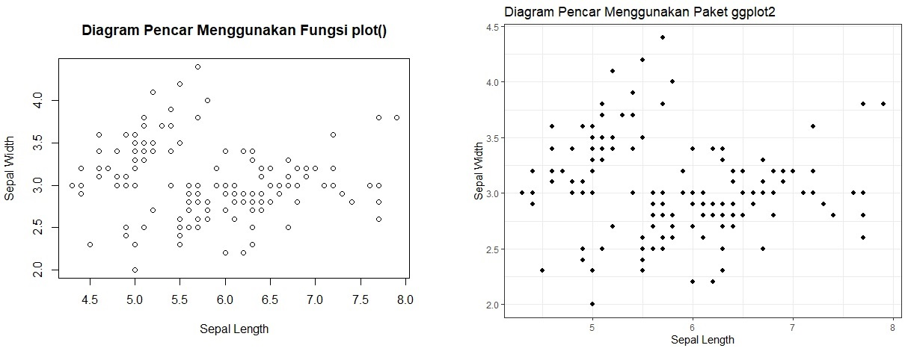

# Pertemuan 1: Pengenalan

## Objek

Objek merupakan sebuah wadah untuk menyimpan informasi (dapat berupa nilai, data, ataupun lainnya) yang telah didefinisikan. Penyimpanan informasi ke dalam sebuah objek memberikan kemudahan bagi pengguna R untuk memanggil informasi yang sama berulang kali hanya dengan memanggil nama objeknya saja. Seringkali sebuah informasi memiliki banyak bagian didalamnya seperti `data frame` atau kerangka data (memiliki kolom-kolom variabel).  Informasi ini akan sangat merepotkan jika harus memanggilnya berulang kali, sehingga dengan mendefinisikannya ke dalam sebuah objek akan mempercepat proses pengerjaannya.


Terdapat beberapa cara dalam mendefinisikan objek pada R seperti yang tersajikan pada tabel berikut:

```{r, echo=FALSE}
Operator = c("<-, =", "->")
Operasi = c("Mendefinisikan objek sebelah kiri",
            "Mendefinisikan objek sebelah kanan")
x <- data.frame(Operator, Operasi)
knitr::kable(
  x,
  booktabs = TRUE,
  caption = "Operator Pendefinisian Objek pada R"
)
```

Contoh penggunaannya adalah sebagai berikut:

```{r}
a <- 4
b <- c(1, 4, 6, 8, 5)
c = c("Indonesia", "Raya")
d = data.frame(X = c(1, 2, 3, 4, 5),
               Y = c("Rondi", "Anis", "Alya", "Budi", "Surya"))
```

Setelah objek didefinisikan, selanjutnya pemanggilan objek dapat dilakukan dengan menggunakan nama obejeknya saja. Contoh, akan kita panggil ketiga objek yang telah didefinisikan sebelumnya yaitu `a, b, c, d` dengan mengetikan masing-masing objek tersebut secara bergantian di `Console`. Berikut hasilnya:
```{r}
a
b
c
d
```

Objek-objek tersebut telah terdefinisikan di RStudio. Perhatikan pada Jendela Environment saat ini sudah ada 4 buah objek yang didefinisikan sebelumnya.

```{r, echo=FALSE, fig.align='center', fig.cap="Jendela Environment yang Sudah Terdapat Objek"}
knitr::include_graphics("images//objek_01.jpg")
```

Objek-objek tersebut dapat dihapu ataupun digantikan dengan nilai yang baru. Untuk menghapus sebuah objek dapat dilakukan dengan menggunakan fungsi `rm(nama_objek)`. Contoh:

```{r}
a = 79
rm(b)
```

Sekarang objek `a` telah memiliki nilai baru yaitu `79` dan objek b tidak tersedia pada Jendela Environment.

```{r, echo=FALSE, fig.align='center', fig.cap="Jendela Environment setelah Penggantian Objek `a` dan Penghapusan Objek `b`"}
knitr::include_graphics("images//objek_02.jpg")
```


## Paket (Packages)

R Packages adalah unit yang sangat fundamental dalam Program R. Dalam sebuah R Packages berisi kode-kode yang dapat digunakan, sampel data dan dokumentasi yang telah dideskripsikan dengan baik untuk mempermudah penggunaannya. Terdapat berbagai macam paket yang tersedia di software repository CRAN ( _The Comprehensive R Archive Network_ ) yang merupakan pusat arsip dari versi-versi paket terbaru dan yang lama (biasanya paket diperbarui oleh pembuatnya untuk keperluan kemudahan penggunanya atau menyesuaikan dengan update terbaru dari R). Tercatat bahwa pada November 2020 sudah terdapat lebih dari 16.000 paket yang tersedia di CRAN.

Sebagai contoh penggunaan paket, akan dilakukan pembuatan grafik dengan menggunakan fungsi `plot()` yang merupakan fungsi bawaan dari R (dari paket `base`) dibandingkan dengan grafik yang menggunakan paket `ggplot2`. Berikut Hasilnya:

```{r, echo=FALSE, fig.align='center', fig.cap="Diagram Pencar Dengan dan Tanpa Menggunakan Paket"}

```

Untuk melakukan instalasi paket, pertama siapkan jaringan internet yang baik. Paket akan di unduh dari repository CRAN. Setelah jaringan internet stabil, gunakan fungsi `install.packages("nama_paket")` lalu jalankan pada Console. 

Pastikan jaringan internet stabil selama proses instalasi paket berlangsung. Biasanya paket-paket dalam R tidak dapat berdiri sendiri atau memerlukan paket lain yang juga harus terinstal. Apabila terdapat 1 paket lain yang diperlukan namun gagal terinstal, maka paket yang akan kita gunakan tidak akan berjalan. Saat ini terjadi biasanya nama paket tidak akan muncul di **Tab Packages** (beberapa kasus nama paket muncul namun tidak dapat menggunakan fungsi yang ada). **Apabila paket tidak berfungsi dengan baik, maka lakukan instalasi ulang pada paket tersebut**.

```{r, echo=FALSE, fig.align='center', fig.cap="Contoh Paket `ggplot2` yang Sudah Terinstal dan Dapat Digunakan", dpi=50}
knitr::include_graphics("images//paket_02.jpg")
```


Secara _default_ CRAN menjadi repository untuk mengunduh paket di RStudio. Sehingga kita tidak perlu mengatur repository lagi. 

Berikut adalah beberapa daftar paket yang harus sudah terinstal (dan dapat digunakan) untuk topik Program R. 

1. `tidyverse` <br />
Digunakan untuk melakukan manajemen pada data. Cara instal paket dengan menjalankan fungsi `install.packages("tidyverse")` pada console
2. `ggplot2` <br />
Digunakan untuk membuat grafik yang lebih bagus. Cara instal paket dengan menjalankan fungsi `install.packages("ggplot2")` pada console
3. `dgof` <br />
Digunakan untuk melakukan uji normalitas menggunakan Metode Kolmogorov-Smirnov. Cara instal paket dengan menjalankan fungsi `install.packages("dgof")` pada console


## Tipe Data {#datatype}

Terdapat 6 tipe data pada bahasa pemrograman R. Setiap tipe data tersebut memiliki karakteristik sendiri sehingga tidak terjadi tumpang tindih dalam melakukan berbagai macam pengoperasiannya. Berikut adalah 6 tipe data pada bahasa pemrograman R:

### Numerik (Numeric) {#numeric}

Tipe data numerik adalah tipe data yang berupa nilai/angka desimal. Tipe data ini merupakan tipe data yang dapat digunakan untuk melakukan operasi-operasi aritmatika seperti penjumlahan, pengurangan, perkailan, dsb. Jika kita definisikan objek `x` dengan suatu nilai/angka, maka tipe objek tersbut adalah `numeric`.

```{r}
x <- 2.6
class(x)
```

Bahkan R akan mendefinisikan objek dengan tipe `numeric` jika berikan angka tanpa desimal.

```{r}
x <- 5
class(x)
```

### Bilangan Bulat (Integer) {#integer}

Seperti yang kita tahu bahwa pendefinisian angka pada suatu objek akan secara otomatis membuat objek tersebut bertipe `numeric`. Sedangkan untuk mendefinisikan objek dengan tipe `integer` harus mendefinisikan secara khusus objek tersebut dengan perintah `as.integer`.

```{r}
x <- as.integer(5)
class(x)
```

Selain itu kita dapat mendefinisikan sebuah objek yang bertipe `integer` dengan menambahkan huruf `L` kapital pada akhir angka.

```{r}
x <- 3L
class(x)
```

Bagaimana jika kita berikan angka desimal pada objek yang kita definisikan sebagai `integer`?

```{r eval=FALSE}
x <- as.integer(3.76)
```

### Bilangan Kompleks (Complex) {#complex}

Bilangan kompleks dalam matematika adalah bilangan yang didefinisikan dengan $a + bi$, dengan $a$ dan $b$ adalah bilangan real. Sedangkan $i$ adalah bilangan imajiner dan menyebabkan $bi$ menjadi imajiner. Bilangan imajiner sendiri memiliki sifat $i^{2}=1$. Kita harus secara langsung mendefinisikan objek sebagai bilangan kompleks agar mendapatkan sebuah objek yang bertipe `complex`.

```{r}
x <- 2 + 4i
class(x)
```

### Logika (Logical) {#logical}

Objek dengan tipe logika adalah objek yang hanya memiliki 2 nilai saja yaitu `TRUE` dan `FALSE`.

```{r}
x <- TRUE
class(x)
```

### Teks (Character) {#character}

Pendefinisian objek dengan tipe teks (`character`) merupakan hal yang cukup mudah. Kita perlu menambahkan tanda petik `"` pada awal dan akhir teks. Setelah itu objek akan terdefinisikan sebagai `character`.

```{r}
x <- "Aplikasi Komputer"
class(x)
x
```

Apakah tipe data dari objek yang didefinisikan dengan nilai `"2.4"`?

### Faktor (Factor) {#factor}

Faktor adalah tipe data pada bahasa pemrograman R yang digunakan untuk mendefinisikan sebuah objek menjadi sebuah objek dengan tipe data kategorik. Perintah yang digunakan untuk merubah sebuah objek menjadi sebuah faktor adalah `factor()`.

```{r}
x <- factor(c(1, 2, 3))
y <- factor(c("SD", "SMP", "SMA", "SMA", "PT"))
x
y
```

Sebuah objek yang telah didefinisikan sebagaik faktor akan memiliki `levels` yang merupakan daftar kategori yang terdapat pada objek tersebut. Kita dapat menggunakan perintah `levels` untuk dapat memunculkan `levels` nya saja.

```{r}
levels(x)
levels(y)
```

* Apa perbedaan _output_ dari objek yang bertipe `factor` dengan objek yang bertipe `numeric`?
* Apa perbedaan _output_ dari objek yang bertipe `factor` dengan objek yang bertipe `character`?


## Struktur Data

Struktur data pada bahasa pemrograman R adalah sebuah konsep yang digunakan untuk menyimpan data berdasarkan kebutuhannya. Berdasarkan struktur datanya, terdapat 4 struktur data yang dapat kita definisikan pada program R:

* Vektor (`vector`)
* Matriks (`matrix`)
* Pendafaran (`list`)
* Kerangka Data (`data.frame`)

### Vektor (Vector) {#vector}

Vektor adalah struktur data yang paling sederhana pada bahasa pemrograman R. Vektor memuat barisan data dengan tipe data yang sama. Pendefinisian vektor dilakukan dengan menggunakan perintah `c()`. Semua data ditulis didalam tanda kurung dan setiap data dipisahkan dengan tanda koma `,`.

```{r}
x <- c(1:5)
x
y <- c("Hipertensi", "Diabetes", "Asam Urat")
y
length(x)
length(y)
```

Apa yang terjadi apabila sebuah vektor diisi dengan 2 tipe data? misalnya `c(12, 4, TRUE)`

Selanjutnya kita dapat memanggil anggota dari sebuah objek `vector` dengan menggunakan tanda `[x]` setelah objek dengan `x` adalah nilai yang menyatakan _data ke-x_.

```{r}
x[2]
y[3]
```

### Matriks (Matrix) {#matrix}

Sama halnya dengan vektor, matriks merupakan struktur data yang hanya dapat menyimpan 1 tipe data saja. Perbedaan antara struktur data 'matrix' dengan 'vector' berada pada dimensi datanya. Vektor merupakan struktur data berdimensi 1 (hanya memiliki panjang data). Sedangkan matriks adalah struktur data yang berdimensi 2 (memiliki dimensi dan panjang data).

Pendefinisian matriks dilakukan dengan menggunakan perintah `matrix` dengan `syntax`: `matrix(data, nrow, ncol, byrow=FALSE)`.

```{r}
x <- matrix(
  c(1:8), 2, 4
)
x
dim(x)
```

dengan:

* `data` adalah data yang akan kita gunakan
* `nrow` adalah jumlah baris
* `ncol` adalah jumlah kolom
* `byrow` adalah perintah opsional untuk memilih agar data yang kita miliki didaftarkan berdasarkan baris atau kolom

Apakah yang akan terjadi apabila kita menggunakan `byrow=FALSE` dan `byrow=TRUE`?

Berbeda dengan objek yang berupa `vector`, pemanggilan data pada objek `matrix` menggunakan tanda `[x,y]` dimana `x` adalah _data baris ke-x_ dan `y` adalah _data kolom ke-y_. Apabila kita menggunakan tanda `[x,]` saja, maka kita memanggil semua data pada _baris ke-x_. Sedangkan apabila kita menggunakan tanda `[,y]` saja, maka kita memanggil semua data pada _kolom ke-y_. 

```{r}
x[2,3]
x[2,]
x[,4]
x[6]
```

Catatan: `x` dan `y` pada `[x,y]` dapat berupa `vector`.

### Daftar (List) {#list}

Struktur data `list` dalam R adalah struktur data yang dapat mendaftarkan beberapa objek sekaligus tanpa perlu khawatir dengan tipe data yang berbeda. Struktur data 'list' dapat juga dikatakan sebagai vektor yang dapat menyimpan berbagai macam objek. Pendefinisian list dilakukan dengan menggunakan perintah `list()`.

```{r}
a <- c(1, 3, 6, 2)
b <- c("Apa", "kabar", "anda", "hari", "ini", "?")
c <- c(TRUE, FALSE, FALSE, FALSE, TRUE)
x <- list(a=a, b=b, c=c)
x
```

Selanjutnya kita dapat memanggil masing-masing objek pada sebuah list dengan `syntax`: `ListObject$ObjekInList` atau dengan menggunakan `[[x]]` dimana `x` adalah sebuah angka yang merujuk pada **daftar ke berapa**.

```{r}
x$a
x[[3]]
```

### Kerangka Data (Data Frame) {#dataframe}

Struktur data yang berupa _data frame_ (`data.frame`) merupakan struktur data yang akan paling sering kita gunakan dalam pengolahan data. Struktur data ini digunakan untuk mendefinisikan sebuah tabel data yang mana setiap kolom adalah nama-nama objek/variabel pada _data frame_ tersebut. Setiap objek/variabel dalam `data.frame` merupakan sebuah `vector`. Artinya setiap objek/variabel dalam `data.frame` hanya dapat memiliki 1 tipe data saja. Selain itu setiap objek/variabel yang berada dalam `data.frame` harus memiliki jumlah data (`length()`) yang sama.

Perintah `data.frame()` adalah perintah yang digunakan untuk medefinisikan sebuah objek sebagai sebuah data frame.

```{r}
nama <- c("Ahmad", "Ganjar", "Lusi", "Andina", "Elok")
jk   <- factor(c("Laki-laki", "Laki-laki", "Perempuan", "Perempuan", "Perempuan"))
tb   <- c(170, 169, 160, 154, 163)
bb   <- c(70, 67, 45, 40, 52)
x    <- data.frame(nama, jk, tb, bb)
x
```

```{r, echo=FALSE}
knitr::kable(
  x, 
  caption = "Data Mahasiswa 2020",
  booktabs = TRUE,
)
```

Selanjutnya untuk memanggil objek/variabel pada sebuah `data.frame` mirip dengan memanggil data pada sebuah `matrix`. Selain itu kita dapat pula memanggil dengan cara menyebutkan nama objek/variabel pada `data.frame` tersebut.

```{r}
x[,2]
x[4,]
x$nama
x[,c('jk', 'nama')]
```

## Operator - operator pada R

Operator - operator pada R adalah perintah untuk melakukan suatu operasi seperti operasi artimatika, logika dan relasi. Secara umum terdapat 4 tipe operator pada R, yaitu:

* Operator Aritmatika
* Operator Logika
* Operator Relasi

### Operator Aritmatika {#operator}

Operator artimatika adalah operator yang digunakan untuk melakukan komputasi dengan menggunakan operasi - operasi matematika seperti penjumlahan, pengurangan, dll. Berikut adalah daftar operator aritmatika pada R:

```{r, echo=FALSE}
x <- data.frame(
  Operator = c("+", "-", "*", "/", "^", "%%"),
  Operasi = c("Penjumlahan", "Pengurangan",
              "Perkalian", "Pembagian",
              "Perpangkatan", "Modulo")
)
knitr::kable(
  x,
  caption = "Operator Aritmatika pada R",
  booktabs = TRUE, 
  align = "c"
)
```

Operator umumnya digunakan untuk pengoperasian pada objek bertipe `numeric` atau `integer` dengan struktur data berupa `vector` dan `matrix`. Berikut adalah contoh penggunaannya:

```{r}
x <- 3
y <- 5
```
```{r, echo=FALSE}
x <- data.frame(
  Operator = c("+", "-", "*", "/", "^", "%%"),
  Operasi = c("x + y", "x - y",
              "x * y", "x / y",
              "x ^ y", "x %% y"),
  Hasil = c(x + y, x - y,
              x * y, x / y,
              x ^ y, x %% y)
)
knitr::kable(
  x,
  caption = "Hasil Penggunaan Operator pada R",
  booktabs = TRUE, 
  align = "c"
)
```

### Operator Logika

Operator logika akan menghasilkan nilai `TRUE` dan `FALSE`. Seperti halnya logika matematika, terdapat 2 operator logika yaitu _dan_ (`AND`), _atau_ (`OR`) dan ingkaran (`NOT`). Berikut adalah daftar operator logika pada R:

```{r, echo=FALSE}
x <- data.frame(
  Operator = c("!", "&", "&&", "|", "||"),
  Operasi = c("Bukan/Ingkaran", "Logika DAN pada masing-masing anggota objek",
              "Logika DAN", "Logika ATAU",
              "Logika ATAU pada masing-masing anggota objek")
)
knitr::kable(
  x,
  caption = "Operator Logika pada R",
  booktabs = TRUE, 
  align = "c"
)
```

Berikut adalah contoh hasil penggunaannya:

```{r}
x <- c(TRUE, FALSE, 5)
y <- c(TRUE, FALSE, FALSE)
z <- c(FALSE, TRUE, TRUE)

!x
x&y
x&&z
x|y
x||z
```

```{r, echo=FALSE}
P1 <- c(TRUE, TRUE, FALSE, FALSE)
P2 <- c(TRUE, FALSE, TRUE, FALSE)
x <- data.frame(
  P1, P2, NegasiP1 = !P1,
  NegasiP2 = !P2, 
  DAN = (P1&P2),
  ATAU = (P1|P2)
)

knitr::kable(
  x,
  caption = "Hasil Penggunaan Operator Logika",
  booktabs = TRUE
)
```

### Operator Relasi {#relational}

Operator relasi adalah operator yang digunakan untuk membandingkan 2 buah nilai/objek. Hasil _output_ dari operator relasi ini adalah `TRUE` dan `FALSE`. Berikut adalah daftar operator relasi:

```{r, echo=FALSE}
Operator = c("<", "<=", ">", ">=", "==", "!=")
Operasi = c("Kurang dari", "Kurang dari sama dengan",
            "Lebih dari", "Lebih dari sama dengan",
            "Sama dengan", "Tidak sama dengan")
x <- data.frame(
  Operator,
  Operasi
)

knitr::kable(
  x,
  caption = "Operasi Relasi pada R",
  booktabs = TRUE
)
```

Operator relasi dapat dioperasikan layaknya operator logika. Berikut adalah contoh penggunaannya:

```{r}
x <- 3
y <- 7
z <- 7
x<y
x>y
x<=y
y<=z
x!=y
y==z

```


### Operator Pipe (`%>%`)


Operator Pipe adalah operator spesial yang terdapat pada paket `magrittr`. Paket `dplyr` juga memiliki operator `%>%` yang dasarnya dibangun oleh paket `magnittr`. Operator ini membuat kita dapat menjalankan fungsi secara berurutan. Contoh penggunaannya (secara sederhana):

```{r}
x = c(1, 2, 3, 4, 5, 6, 7)

# Contoh 1
x %>% mean()

# Contoh 2
x %>% mean() %>% log()
```

Perhatikan bahwa baris pertama menunjukkan sebuah objek `x` yang berisikan vektor nilai 1 sampai 7. Selanjutnya pada contoh 1 kita menggunkan 1 operator `%>%` pada objek `x` yang dilanjutkan dengan fungsi `mean()`. Apakah dapat dipahami bagaimana cara operator `%>%` bekerja? `x %>% mean()` akan menghasilkan nilai rataan dari objek `x` yang menunjukkan bahwa fungsi `mean()` (fungsi setelah `%>%`) digunakan untuk objek sebelumnya `%>%` yaitu `x`. **Hasil ini akan sama dengan hasil dari `mean(x)`**.

Contoh 2 menambahkan 1 operator `%>%` setelah fungsi `mean()`. Apakah dari hasil yang didapat (`1.386294`) bisa menjadi petunjuk bagaimana operator `%>%` bekerja? fungsi setelah operator `%>%` yang kedua digunakan untuk objek sebelumnya yang mana objek sebelumnya adalah hasil dari `x %>% mean()`. **Hasil ini akan sama dengan hasil dari `log(mean(x))`**.
