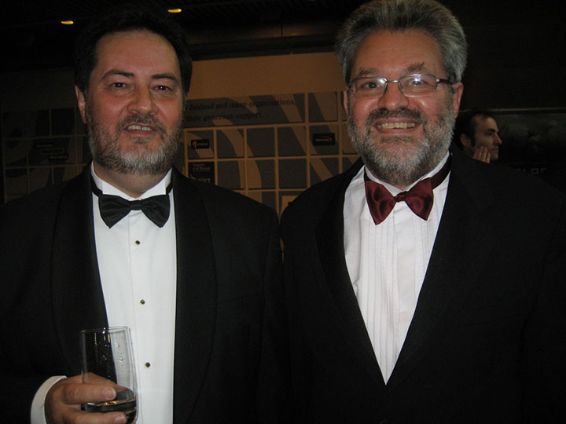
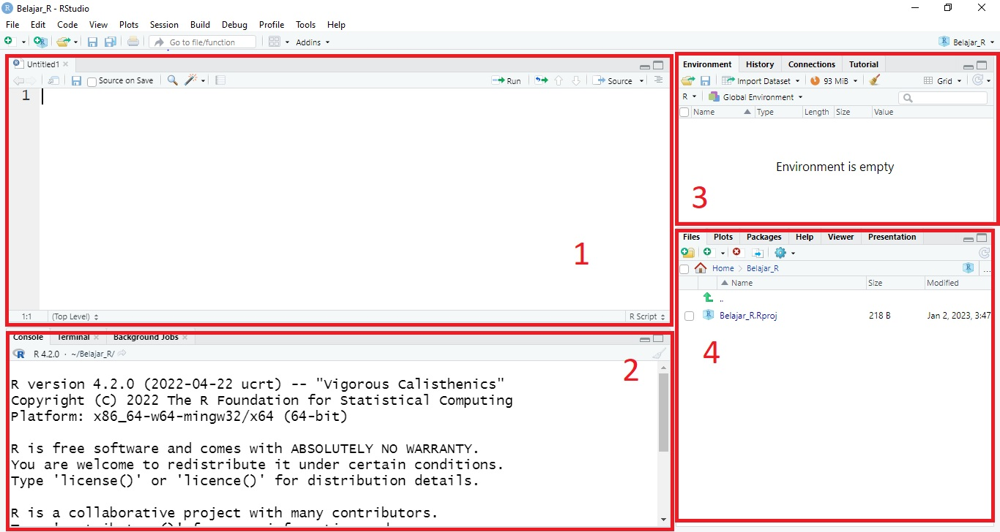

--- 
title: "`Dasar Pemrograman R`"
author: "'`dimas`"
date: "`r Sys.Date()`"
site: "bookdown::bookdown_site"
output: bookdown::gitbook
documentclass: book
bibliography: [book.bib, packages.bib]
biblio-style: apalike
link-citations: yes
github-repo: rstudio/bookdown-demo
description: "This is a minimal example of using the bookdown package to write a book. The output format for this example is bookdown::gitbook."
---

# Pengantar

## Sejarah Program R

R adalah salah satu bahasa pemrograman yang khusus dibuat untuk melakukan komputasi statsistik. Program R dibuat oleh **Ross Ihaka** dan **Robert Gentleman** berdasarkan (sangat mirip) pada bahasa pemrogram S yang perlu mengeluarkan beberapa rupiah untuk dapat menggunakannya. Sedangkan R adalah **_open source_**.

```{r, echo=FALSE, fig.align='center', fig.cap="**Ross Ihaka** dan **Robert Gentleman**"}

```


## Program R

R secara resmi diluncurkan pertama kali pada 29 Februari 2000 (R 1.0). Banyak pengguna menganggap R adalah sebuah sistem statistika. Hal ini dikarenakan R sangat terinspirasi dengan Program S yang memang dibuat khusus untuk pemrograman statistik. 

R memberikan banyak kemudahan bagi pemula yang masih baru memulai belajar pemrograman (terutama dalam hal statistik). Hal ini dikarenakan terdapat berbagai fungsi-fungsi dasar statistik yang sangat mirip dengan nama metode statistikanya, seperti untuk menghitung nilai rata-rata (mean) menggunakan fungsi  `mean()`  di R. Selain dapat digunakan dalam berbagai macam teknik statistika (dengan menggunakan `paket` yang berkaitan tentunya), R dapat digunakan untuk membuat grafik sesuai dengan kebutuhan penggunanya. 

Salah satu keunggulan R adalah memiliki komunitas yang besar. Siapa saja dapat membuat sebuah `paket` yang terdiri dari berbagai fungsi. `Paket-paket` dalam R dikembangkan dari berbagai bidang seperti ahli statistik, programmer, psikolog, dsb. Setiap `paket` memiliki tujuan masing-masing sesuai dengan kegunaan yang diinginkan oleh pembuatnya.

**Kenapa harus menggunakan R?**

- Gratis dan _open source_.
- Tersedia untuk Windows, Macintosh dan Linux.
- Kualitas gambar yang bagus.
- Pengguna dapat menentukan penggunaan metode statistika dengan algoritma tertentu.
- Ketersediaan berbagai macam paket statistik ( _statistical packages_ ) yang dapat digunakan secara gratis.


### Instalasi Program R 
Untuk menjalankan R, maka langkah pertama yang harus dilakukan adalah melakukan instalasi Program R di komputer/laptop anda. Paket instalasi Program R dapat di unduh pada link berikut: 

- <a href="https://cran.r-project.org/bin/windows/base/" target="_blank">for Windows</a>
- <a href="https://cran.r-project.org/bin/macosx/" target="_blank">for Macintosh</a>

Setelah paket instalasi berhasil di unduh, selanjutnya klik 2x pada paket tersebut lalu ikuti langkah-langkah sebagai berikut:

1. Pilih bahasa yang akan digunakan. Lalu klik `next`
```{r, echo=FALSE, fig.align='center', fig.cap="Pilih Bahasa yang Akan Digunakan"}
knitr::include_graphics("images//Instal R//01.jpg")
```

2. Baca Lisensi Program. Setelah itu klik `next`
```{r, echo=FALSE, fig.align='center', fig.cap="Lisensi Program"}
knitr::include_graphics("images//Instal R//02.jpg")
```

3. Pilih folder tempat (direktori) R di instal. Lalu klik `next`
```{r, echo=FALSE, fig.align='center', fig.cap="Pilih Direktori Tempat R Diinstal"}
knitr::include_graphics("images//Instal R//03.jpg")
```

4. Pilih komponen yang akan di instal (dapat dipilih semua). Lalu klik `next`
```{r, echo=FALSE, fig.align='center', fig.cap="Pemilihan Komponen yang akan Diinstal"}
knitr::include_graphics("images//Instal R//04.jpg")
```

5. Selanjutnya pemilihan `startup`. Pilih `No`, Lalu klik `next`
```{r, echo=FALSE, fig.align='center', fig.cap="Pemilihan Startup"}
knitr::include_graphics("images//Instal R//05.jpg")
```

6. Lalu tunggu hingga proses instalasi selesai. Lalu klik `next` (jika diperlukan).
```{r, echo=FALSE, fig.align='center', fig.cap="Proses Instalasi"}
knitr::include_graphics("images//Instal R//06.jpg")
```

7. Instalasi R telah selesai. Klik `finish`
```{r, echo=FALSE, fig.align='center', fig.cap="Proses Instalasi telah Selesai"}
knitr::include_graphics("images//Instal R//07.jpg")
```

8. Dapat dipastikan kembali bahwa proses instalasi program telah berjalan dengan membuka program. Apabila tidak muncul permasalahan ( _error_ ), maka proses instalasi program telah berhasil.
```{r, echo=FALSE, fig.align='center', fig.cap="Icon Program R pada Layar Desktop"}
knitr::include_graphics("images//Instal R//08.jpg")
```


## R Studio

R Studio atau `RStudio` adalah _open source_ _integrated development environment_ IDE untuk R. R harus ter-instal terlebih dahulu sebelum melakukan instalasi RStudio. **Tampilan antarmuka RStudio yang terorganisasi dengan baik membuat pengguna dapat melihat dengan jelas kode R, grafik, tabel data, dan _output_ secara bersamaan**. Selain itu terdapat fasilitas Import Wizard (panduan import) seperti di program-program lain. R juga dapat mengimgport berbagai macam jenis file data seperti CSV, XLS/XLSX, SAS, SPSS, Stata tanpa harus membuat kode untuk melakukannya.


### Instalasi Program R Studio
Untuk melakukan instalasi program RStudio, unduh file paket instalasi pada link berikut:

- <a href="https://download1.rstudio.org/electron/windows/RStudio-2022.12.0-353.exe" target="_blank">for Windows</a>
- <a href="https://download1.rstudio.org/electron/macos/RStudio-2022.12.0-353.dmg" target="_blank">for Macintosh</a>
- <a href="https://download1.rstudio.org/electron/bionic/amd64/rstudio-2022.12.0-353-amd64.deb" target="_blank">for Ubuntu 18+ / Debian 10+</a>

Setelah paket instalasi berhasil di unduh, selanjutnya klik 2x pada paket tersebut lalu ikuti langkah-langkah sebagai berikut:

1. Klik `next` pada jendela pertama.
```{r, echo=FALSE, fig.align='center', fig.cap="Jendela Pertama Instalasi RStudio"}
knitr::include_graphics("images//Instal RStudio//01.jpg")
```

2. Pilih direktori tempat RStudio di instal.
```{r, echo=FALSE, fig.align='center', fig.cap="Pemilihan Direktori Instalasi RStudio"}
knitr::include_graphics("images//Instal RStudio//02.jpg")
```

3. Pilih nama direktori untuk menu di Start Menu
Pilih direktori tempat RStudio di instal.
```{r, echo=FALSE, fig.align='center', fig.cap="Pemilihan Direktori di Start Menu"}
knitr::include_graphics("images//Instal RStudio//03.jpg")
```

4. Tunggu hingga proses instalasi selesai lalu klik `finish`.
Pilih direktori tempat RStudio di instal
```{r, echo=FALSE, fig.align='center', fig.cap="Proses Instalasi RStudio"}
knitr::include_graphics("images//Instal RStudio//04.jpg")

```

5. Lakukan pengecekan kembali untuk memastikan RStudio telah terinstal.
```{r, echo=FALSE, fig.align='center', fig.cap="Pengecekan RStudio di Start Menu"}
knitr::include_graphics("images//Instal RStudio//05.jpg")
```


### Lingkungan Kerja RStudio

Sebelum membahas tentang lingkungan kerja RStudio, siapkan R Script terlebih dahulu. Klik File -> New File -> R Script, atau gunakan tombol Ctrl + Shift + N. Selanjutnya tampilan antarmuka RStudio akan seperti gambar berikut:

```{r, echo=FALSE, fig.align='center', fig.cap="Tampilan Antarmuka RStudio"}
knitr::include_graphics("images//Antarmuka//01.jpg")
```

Terdapat 4 jendela dalam RStudio. Masing-masing jendela memiliki kegunaannya masing-masing dan dalam praktikya, hampir semua jendela akan digunakan. Sehingga pemahaman terhadap kegunaan setiap jendela adalah langkah pertama sebelum belajar lebih jauh dalam menggunakan RStudio. Berikut pembagian jendela pada Rstudio:

```{r, echo=FALSE, fig.align='center', fig.cap="Pembagian Jendela Antarmuka RStudio"}

```

Berikut penjelasan pada masing-masing jendela:

1. **R Script Editor** <br />
R Script Editor adalah tempat kita untuk membuat dan menyusun kode-kode R yang akan dijalankan di Jendela Console. Secara teknis pengerjaan R dilakukan pada Console, namun dalam praktiknya pengguna biasanya tidak hanya menggunakan 1 atau 2 baris kode saja, namun hingga ratusan baris kode. Jika ratusan baris kode di susun dalam Console akan membuat pengguna kesulitan dalam melanjutkan pada baris berikutnya (karena lupa, atau ada yang kode yang salah). Apabila kode-kode tersebut disusun dalam R Script, pengguna dapat dengan bebas mengganti kode-kode yang salah hingga menyusun ulang kode yang dibuat. Tentu hal ini membuat pekerjaan jauh lebih mudah.

2. **Console** <br />
Jendela Console adalah jendela untuk menjalankan kode-kode R (R Script). Setiap kode R hanya dapat dijalankan di Console. Untuk melihat cara kerjanya secara langsung, coba ketikan kode `5 + 5` di R Script lalu tekan `Enter`. Perhatikan apakah RStudio memberikan hasil dari `5 + 5` tersebut? Tentu tidak akan terjadi apa-apa pada RStudio. Nah, sekarang ketikan `5 + 5` di Console lalu tekan `Enter`. Perhatikan bahwa dalam Console `5 + 5` akan menghasilkan nilai `10`. Hal ini menunjukkan bahwa R Script bukanlah tempat untuk menjalankan kode R, melainkan Console. Untuk menjalakan kode dari R Script ke Console dapat dilakukan dengan meletakkan `cursor` pada baris yang akan dijalankan pada Console lalu tekan `Ctrl + Enter`.

3. **Environment, History, Connection, Tutorial**  <br />
Jendela ke-3 yang akan sering digunakan adalah Tab `Environment`. Tab `Environment` menunjukkan objek-objek yang ada atau telah kita buat (pembuatan objek akan dibahas pada chapter berikutnya). 

4. **Files, Packages, Plot, Help, Viewer, Presentation**  <br />
Jendela ke-4 yang akan sering digunakan terutama bagi pemula adalah Tab Files, Packages, Plot dan Help. 
    - **Tab Files** menunjukkan file-file yang ada pada direktori kerja kita (akan menyesuaikan dengan proyek yang digunakan). Direktori kerja akan sangat membatu saat kita bekerja dengan beberapa file R Script atau file lainnya (data, gambar, dsb.). 
    - **Tab Packages** adalah jendela yang menunjukkan paket-paket R yang telah ter-instal di RStudio (penjelasan paket akan dibahas pada chapter berikutnya). Apabila paket tersebut telah ter-instal maka kita dapat mengaktifkan paket dengan men-centang pada kotak disebelah kiri paket (dapat diaktifkan juga dengan kode `library(nama_paket)`. 
    - **Tab Plot** ini akan memunculkan grafik-grafik yang telah kita buat (pembuatan grafik akan dibahas pada chapter Membuat Grafik dengan `ggplot2`).
    - **Tab Help** akan digunakan apabila kita ingin mngetahui bagaimana `syntax` (tata cara penggunaan/susunan fungsi) dari suatu fungsi. Selain itu jendela ini juga dapat digunakan untuk melihat fungsi-fungsi apa saja ya tersedia dalam sebuah paket.


Save Workspace berguna untuk menyimpan environment dan history yang telah ada saat itu, sehingga environment dan history akan tetap seperti yang sebelumnya saat membuka kembali proyek tersebut. Workspace biasanya disimpan saat kita bekerja dengan banyak fungsi dan objek yang akan digunakan kembali saat proyek dibuka. Namun biasanya dalam perkuliahan topik selanjutnya akan menggunakan data yang berbeda, sehingga menyimpan workspace tidak disarankan agar tidak membuat kebingungan.


### Membuat Projek Baru
`RStudio` memberikan kita kemudahan dalam membagi pekerjaan dengan menggunakan konsep `Proyek`. Setiap `proyek` memiliki lingkungan kerjanya masing-masing. Hal ini merupakan salah satu hal yang membuat `RStudio` sangat digemari bahkan dikalangan programmer. Membuat sebuah proyek baru dapat dilakukan dengan cara sebagai berikut:

1. Klik Tombol `Project (None)` pada posisi kanan atas. 

2. Stelah itu akan muncul jendela sebagai berikut. Klik `New Directory` jika belum menyiapkan **direktori kerja utama** untuk menyimpan `proyek`, atau klik `Existing Directory` jika sudah memiliki **direktori kerja utama** yang telah ditentukan
```{r, echo=FALSE, fig.align='center', fig.cap="Membuat Proyek Baru"}
knitr::include_graphics("images//Projek Baru//01.jpg")

```

3. Selanjutnya dapat disesuaikan. Pilih `New Project` jika yang akan dikerjakan ini masih baru (belum masuk dalam `proyek` manapun).
```{r, echo=FALSE, fig.align='center', fig.cap="Proses Pembuatan Proyek Baru (step 2)"}
knitr::include_graphics("images//Projek Baru//02.jpg")

```

4. Selanjutnya tentukan nama **sub direktori kerja** jika **sub direktori kerja** yang diinginkan tidak ada. **Lalu klik `Create Project`**. Jika sebelumnya telah memiliki **sub direktori kerja**, klik `Browse...` untuk memilih direktori secara manual.
```{r, echo=FALSE, fig.align='center', fig.cap="Proses Pembuatan Proyek Baru (step 3)"}
knitr::include_graphics("images//Projek Baru//03.jpg")

```

5. Setelah itu maka tampilan `RStudio` akan kembali seperti semula. (Perhatikan pada bagian kanan atas, nama `proyek` sudah menyesuaikan dengan nama yang kita buat sebelumnya. Bukan lagi dengan nama `Project (None)`)
```{r, echo=FALSE, fig.align='center', fig.cap="Proses Pembuatan Proyek Baru (step 4)"}
knitr::include_graphics("images//Projek Baru//04.jpg")

```


